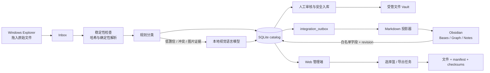

# Academic Vault 下一阶段开发方案（Windows First）

版本：1.2  
日期：2026-07-15  
状态：已确认方向，待下一开发对话执行  
项目开发目录：`C:\Research Data\DEVELOPMENT\academic-vault`

## 1. 已确认的产品决策

1. 当前开发只交付 Windows 工作站版，先把它做成完整、稳定、可日常使用的 Academic Vault：
   - Windows 独立拥有 Inbox、受管 Vault、SQLite catalog、本地模型、Web 服务和 Obsidian Vault。
   - 当前里程碑不实现、不安装、不验收任何 Mac 专用组件。
   - 未来 Mac 版将是另一套完整独立部署，不作为 Windows 的远程客户端，也不共享活动 SQLite。
2. Windows 新建独立 Obsidian Vault：`C:\Research Data\academic-notes`。
3. 当前只实现 Windows 本地模型：`Qwen3-VL-8B-Instruct Q8_0` + llama.cpp CUDA。
   - `Qwen3.5-9B` 作为 Windows 挑战模型；只有通过本项目真实数据验收门才可替换生产模型。
   - Mac 的量化、Metal runtime、安装脚本和实机调优全部延期；未来仍复用同一 provider 契约、taxonomy 和 JSON Schema。
4. Academic Vault 继续负责数据事实、安全入库、AI 建议、人工审核和文件级统一导出。
5. Obsidian 负责知识笔记、项目/样品/实验/方法/文章关系、Bases 和 Graph；不直接读取 SQLite。
6. Web 前端保留为高级管理入口，负责 AI 审核、文件级选择、导出、任务状态和集成配置。
7. 本方案先交接给下一开发对话；本轮不下载模型、不安装 Obsidian、不实现新功能。

## 2. 成功标准

下一阶段完成后，用户应能实现以下闭环：

1. 把一批原始文件拖入本机 `inbox`。
2. 系统等待文件写入稳定，计算 SHA-256，执行确定性解析、规则分类和必要的本地模型推理。
3. SQLite 产生可追溯的数据集与文件记录；不确定项进入人工审核。
4. Obsidian 自动出现新的 Dataset Markdown 记录，Bases 可筛选，Graph 可显示项目、样品、方法和文章关系。
5. 用户可在 Obsidian 撰写笔记和维护允许回写的知识字段，不会覆盖数据库拥有的哈希与文件事实。
6. 用户可在 Web 中跨页选择数据集或逐个选择文件，例如精确选择文章使用的 18 个文件。
7. 一键生成可复现导出包，包含文件、manifest 和 SHA-256 清单。
8. Windows 版达到可日常使用、可备份恢复、可审计的发布标准；代码保留清晰的模型 provider 和路径 profile 边界，未来可增加 Mac 实现而不重写数据库业务层。

## 3. 不可破坏的安全边界

- `data ref` 始终只读；不得移动、改名、覆盖或删除。
- Inbox 原文件默认保留；接受后只创建经 SHA-256 验证的受管副本。
- 模型只有“建议权”，没有文件系统写权限，也不能直接接受分类。
- 浏览器和 Obsidian API 只接收稳定 ID，不接收客户端提供的任意源路径。
- 所有服务默认只监听 `127.0.0.1`。
- 不允许路径穿越、符号链接逃逸、静默覆盖或未校验导出。
- 数据库迁移前自动备份 catalog；迁移必须可重复运行并可审计。
- 不通过 OneDrive、iCloud 或 Obsidian Sync 实时同步活动 SQLite。
- 不把 raw 数据目录软链接或 junction 到 Obsidian Vault。
- API 断开时禁止显示演示数据冒充真实科研数据。

## 4. 当前基线

现有应用位于：

- 开发副本：`academic-vault-src`（本方案迁移后使用 `C:\Research Data\DEVELOPMENT\academic-vault`）。
- Windows 安装版：`C:\Research Data\academic-vault`。
- Windows catalog：`C:\Research Data\catalog\academic_vault.sqlite3`。

当前技术栈：

- FastAPI + SQLite
- React 19 + Vite
- 规则优先分类
- 可选 scikit-learn 轻量模型接口
- SHA-256 校验和无覆盖复制

当前真实数据基线：

- 822 个文件
- 452 个逻辑数据集
- 450 个已索引
- 2 个待审核
- 约 2.29 GB

必须先修的已知问题：

1. 前端当前一次最多请求 500 条数据，超过后会漏显示。
2. API 断开时前端会回退到 seed 演示数据，不适合科研生产环境。
3. `auto_accept_threshold` 已出现在配置中，但没有真正驱动 Inbox 自动接收。
4. 数据库仍把根目录写死为绝对路径，不利于迁移数据根目录，也会增加未来移植成本。
5. 当前模型目录为空，实际状态仍为 rules-only。
6. 当前表格左侧“复选框”只是详情选中样式，不是真正的多选状态。
7. SQLite schema 尚无正式 migration runner、导出、AI 任务或 Obsidian outbox 表。

## 5. 目标架构



### 5.1 数据权责

| 类型 | 唯一拥有者 | 示例 |
|---|---|---|
| 文件事实 | SQLite | ID、SHA-256、大小、受管路径、来源、hash state |
| AI 建议 | SQLite | 模型、量化、prompt/schema 版本、置信度、证据 |
| 用户笔记 | Obsidian | Research notes、想法、评价、自由正文 |
| 知识关系 | Obsidian 为主 | related、used_in、项目/样品/文章链接 |
| 人工分类修正 | 共享、带 revision | modality、sample、workstream、status |
| 导出事实 | SQLite | export ID、选中文件快照、manifest 哈希、结果路径 |

## 6. 目标目录布局

### 6.1 Windows

```text
C:\Research Data\
├─ DEVELOPMENT\
│  └─ academic-vault\            # 下一阶段开发源码
├─ academic-vault\               # 稳定安装版，不在开发时直接修改
├─ academic-notes\               # 独立 Obsidian Vault
│  ├─ .obsidian\
│  └─ Academic Vault\
│     ├─ Datasets\
│     ├─ Projects\
│     ├─ Samples\
│     ├─ Experiments\
│     ├─ Methods\
│     ├─ Papers\
│     ├─ Dashboards\
│     └─ Assets\Previews\
├─ data ref\                      # 只读参考数据
├─ inbox\
├─ vault\
├─ quarantine\
├─ catalog\
├─ models\
├─ exports\
└─ backups\
```

### 6.2 未来 macOS 兼容边界（不在本期实现）

当前不设计 Mac 目录、不写 Mac 安装脚本、不下载 Mac 模型，也不做跨设备同步。Windows 开发只守住三条兼容边界：

- 业务数据保存 `root_key + relative path`，实际根目录由 profile 解析，避免把 `C:\` 路径散落在业务逻辑中。
- 本地模型通过 `LocalModelProvider` 接口接入，CUDA 细节不进入分类规则和数据库服务。
- 当前 Windows catalog 拥有稳定 `library_id`；未来 Mac 版创建自己的 library 和 SQLite，不共享活动数据库。

## 7. 建议代码结构

在现有仓库基础上增加：

```text
backend/
├─ migrations/
│  ├─ runner.py
│  └─ versions/
├─ paths.py                       # root key + relpath 与本机路径解析
├─ ai/
│  ├─ base.py                    # LocalModelProvider 契约
│  ├─ llama_cpp_provider.py
│  ├─ schemas.py                 # Pydantic 输入输出与枚举
│  ├─ prompts.py
│  ├─ registry.py
│  ├─ worker.py
│  └─ benchmark.py
├─ exports/
│  ├─ service.py
│  ├─ manifest.py
│  └─ worker.py
├─ integrations/
│  └─ obsidian/
│     ├─ projector.py
│     ├─ parser.py
│     ├─ outbox.py
│     ├─ templates.py
│     └─ service.py
└─ tests/

frontend/src/
├─ components/
├─ features/
│  ├─ catalog/
│  ├─ export/
│  ├─ integrations/
│  ├─ models/
│  └─ tasks/
└─ design-system/

integrations/
└─ academic-vault-bridge/         # 私有 Obsidian 插件

profiles/
├─ windows-rtx5080.json
└─ schema.json

scripts/
├─ install-windows.ps1
├─ start-windows.ps1
├─ benchmark-model.py
└─ backup-catalog.py
```

不要把后续功能继续堆进单个 `App.jsx`、`database.py` 或 `classifier.py`。

## 8. 数据库迁移方案

### 8.1 正式迁移机制

- 在 `app_metadata` 保存 `schema_version`。
- 每个 migration 在单个事务内执行。
- 迁移前创建一致性快照到 `backups/catalog-<UTC timestamp>.sqlite3`：服务运行时使用 SQLite Online Backup API；离线时先停止写入并 checkpoint WAL。快照与原库都必须通过 `PRAGMA integrity_check`。
- 每个版本只执行一次；重复启动不得重复加列或破坏数据。
- 每个 migration 必须有升级测试和已有真实 schema 的 fixture。

### 8.2 路径可移植化

给 `assets` 增加：

```text
original_root_key
original_relpath
managed_root_key
managed_relpath
```

绝对路径可以暂时保留作兼容，但新代码只能通过 root mapping 解析：

```json
{
  "reference": "C:\\Research Data\\data ref",
  "inbox": "C:\\Research Data\\inbox",
  "vault": "C:\\Research Data\\vault",
  "exports": "C:\\Research Data\\exports"
}
```

现有数据采用两阶段回填，禁止直接把新列设为非空后碰运气启动：

1. 先增加可空 root/relpath 与 `library_id` 字段，并为当前 Windows catalog 创建一个稳定 library UUID。
2. 把现有 452 个 dataset 绑定到该 library；逐个 asset 使用“最长匹配的已配置根目录”确定 root key，再用规范化、无 `..` 的相对路径回填。
3. 每个回填路径重新解析并验证仍位于对应根目录；文件存在时核对原记录的大小与 SHA-256。
4. 无法归入 reference/inbox/vault 的记录保持 legacy absolute path，标记 `PATH_REVIEW`，禁止接受、移动和导出，不静默猜测根目录。
5. 比较迁移前后 dataset/asset 数、状态分布和哈希；任何数量变化、路径逃逸、完整性失败或异常批量 `PATH_REVIEW` 都回滚到快照。
6. 全部验证通过后再重建 SQLite 表施加非空/外键约束，并做一次从备份恢复的演练。

### 8.3 新表

```text
libraries(
  id, name, machine_profile, device_id, created_at, updated_at
)

model_registry(
  id, provider, base_model, source_revision, quantization,
  model_digest, projector_digest, runtime_revision,
  prompt_version, schema_version, enabled, created_at
)

ai_tasks(
  id, dataset_id, state, reason, attempts, priority,
  input_fingerprint, created_at, started_at, finished_at, error
)

ai_runs(
  id, task_id, dataset_id, model_id, output_json,
  confidence, latency_ms, input_fingerprint, created_at
)

collections(
  id, name, purpose, created_at, updated_at
)

collection_items(
  collection_id, asset_id, position, added_at
)

exports(
  id, collection_id, name, purpose, status, export_mode,
  archive_path, manifest_sha256, file_count, total_bytes,
  created_at, finished_at, error
)

export_items(
  export_id, asset_id, source_kind, source_sha256,
  exported_relpath, exported_sha256, position
)

integration_outbox(
  seq, integration, aggregate_type, aggregate_id,
  aggregate_revision, event_type, payload_json,
  created_at, processed_at, attempts, last_error
)

knowledge_entities(
  id, library_id, entity_type, canonical_key, display_name,
  revision, tombstoned_at, created_at, updated_at
)

knowledge_relations(
  id, library_id, source_type, source_id,
  relation_type, target_type, target_id, created_at
)

obsidian_links(
  library_id, aggregate_type, aggregate_id, vault_id, note_path,
  last_aggregate_revision, last_note_hash, sync_state,
  last_synced_at, last_error
)
```

给 `datasets` 增加非空 `library_id` 和单调递增的 `revision`；给 `collections`、`exports` 与 `integration_outbox` 增加非空 `library_id`。`assets` 通过非空 `dataset_id` 归属 library，不重复保存可漂移的 library 值。所有顶层 ID 使用 UUID；设备本地自然唯一约束包含 `library_id`。所有用户或分类状态变更都必须在同一事务中增加 revision 并写 outbox。

## 9. 本地 AI 方案

### 9.1 模型 profile

本期唯一生产 profile：

```json
{
  "profile_id": "windows-rtx5080",
  "provider": "llama.cpp",
  "model": "Qwen3-VL-8B-Instruct",
  "quantization": "Q8_0",
  "device": "CUDA",
  "context_tokens": 8192,
  "max_output_tokens": 512,
  "temperature": 0,
  "parallel_requests": 1,
  "host": "127.0.0.1"
}
```

不要因为模型宣传支持 256K context 就在本项目打开超长上下文。文件分类输入应保持短、结构化和可审计。

Mac profile 不在本期创建。未来只需新增 provider/profile 与安装适配，不改变本节的输入输出契约。

生产模型必须有可提交 Git 的 `profiles/windows-model-lock.json`，至少锁定：

- 模型源仓库、精确 revision 与许可证；
- 主 GGUF 文件名/字节数/SHA-256；视觉 projector（mmproj）文件名/字节数/SHA-256；
- tokenizer、chat template、prompt、taxonomy 和输出 schema 版本；
- llama.cpp commit、CUDA build 参数和启动参数；
- context、图像缩放、temperature、seed、threads、GPU layers 与并发数。

模型大文件本身不进入 Git；下载完成后只有 lock 中所有哈希匹配才允许注册为可用模型。

### 9.2 推理触发策略

1. 确定性读取：扩展名、文件头、sheet、列名、仪器元数据、图片尺寸。
2. 规则层：内置规则与用户规则。
3. 只有以下情况进入 AI 队列：
   - Unknown；
   - 规则置信度不足；
   - 规则互相冲突；
   - 关键信息只存在图片像素中；
   - 用户要求重新分析。
4. AI 只能输出固定 JSON Schema。
5. 后端再次验证枚举、名称、证据和置信度。
6. 初期所有 AI 结果仍进入 REVIEW；达到验收门后才讨论有限自动接收。

### 9.3 输出契约

```json
{
  "modality": "SEM",
  "workstream": "PA_ADR_RECYCLE",
  "sample_id": "PA66-R3",
  "material": "PA66",
  "test_method": "SEM",
  "conditions": {},
  "proposed_name": "PA66-R3__SEM__20260715",
  "confidence": 0.94,
  "evidence": [
    {"kind": "image_text", "value": "scale bar and SEM overlay detected"}
  ],
  "needs_review": false,
  "abstain_reason": null
}
```

模型输出不能直接成为置信度真值；最终系统置信度必须结合规则一致性、解析证据和模型校准。

### 9.4 挑战模型

`Qwen3.5-9B` 只在 benchmark harness 中启用，固定 runtime 版本、模板与 thinking 设置。通过以下所有门槛后，才能提交“替换生产模型”的单独变更：

- 结构化输出合法率 100%。
- 已知 modality 准确率 ≥ 95%。
- 错误自动接受率 ≤ 0.5%。
- Unknown/冲突召回 ≥ 95%。
- AI 触发任务 p95 ≤ 30 秒；峰值 VRAM ≤ 显卡物理显存的 90%；连续 2 小时队列测试无崩溃、泄漏性增长或静默丢任务。

评估集应从现有 452 个数据集中分层抽取 150–200 个，并遮蔽包含答案的父目录名。

本期只以 Windows RTX 工作站上的结构化输出、准确率、延迟、显存与稳定性作为模型生产验收依据。

### 9.5 自动接收契约

- Phase 0 起默认 `auto_accept_enabled=false`；扫描、建记录、AI 给出建议与“接受并写入受管 Vault”是不同动作。
- 当前未实际生效的 `auto_accept_threshold` 不得继续以可用功能显示。Phase 0 将其移除，或明确改名为仅影响审核排序的 `ai_review_threshold`。
- Reference 的只读索引不等同于把 Inbox 文件自动接受进受管 Vault。
- 本期所有 AI 结果一律进入 REVIEW；模型不得直接触发文件复制、移动、改名、覆盖或接受。
- 若未来启用自动接受，必须另行提交变更：仅允许经过 benchmark 的确定性规则、类别 allowlist、可审计开关和紧急停用；不得只凭模型自报置信度开启。

## 10. Obsidian 集成方案

### 10.1 第一阶段：Markdown 投影

后台投影器消费 `integration_outbox`，在 Obsidian Vault 中创建一条 Dataset note。Obsidian 是否运行不影响入库；若未运行，笔记仍先落盘。

每个逻辑数据集一条笔记，不为每个 raw 文件创建 Graph 节点。文件作为受管清单显示在 Dataset note 中。

推荐路径：

```text
Academic Vault/Datasets/<initial-readable-slug>--<short-id>.md
```

文件生成后不因分类变化自动移动。永久身份是 `av_id`，不是文件名。

Project、Sample、Experiment、Method 和 Paper 也必须先进入 `knowledge_entities`，各自拥有稳定 UUID、revision 和 `entity_type`，再生成 `<initial-slug>--<short-id>.md`。规则如下：

- `(library_id, entity_type, canonical_key)` 唯一；同名但实际不同的实体必须由用户拆分，不能自动合并。
- display name 或 alias 改变不移动笔记；链接使用稳定文件名并用 Obsidian alias 显示可读名称。
- Dataset 与知识实体的边写入 `knowledge_relations`，不靠普通字符串猜关系。
- 实体合并必须保存 redirect；删除只写 tombstone，不自动删除含用户笔记的 Markdown。
- `obsidian_links` 对所有 aggregate type 生效，不再只处理 Dataset。

示例：

```markdown
---
av_id: "019f..."
av_library_id: "019e..."
av_revision: 12
av_kind: dataset
title: "PA66 recycle SEM"
aliases:
  - "PA66 SEM batch 15"
project: "[[Academic Vault/Projects/pa-adr-recycle--a1b2c3|PA ADR Recycle]]"
sample: "[[Academic Vault/Samples/pa66-r3--d4e5f6|PA66-R3]]"
experiment: "[[Academic Vault/Experiments/exp-2026-0715--112233|EXP-2026-0715]]"
method: "[[Academic Vault/Methods/sem--445566|SEM]]"
status: review
confidence: 0.94
file_count: 7
size_bytes: 28736142
tags:
  - academic-vault/dataset
  - modality/sem
related: []
used_in: []
---

# PA66 recycle SEM

关联：[[Academic Vault/Projects/pa-adr-recycle--a1b2c3|PA ADR Recycle]] · [[Academic Vault/Samples/pa66-r3--d4e5f6|PA66-R3]] · [[Academic Vault/Methods/sem--445566|SEM]]

## 文件清单

<!-- academic-vault:managed:start -->
由数据库维护的文件、哈希、格式与分类证据。
<!-- academic-vault:managed:end -->

## Research notes

用户自由笔记。投影器不得覆盖本节。
```

规则：

- Properties 保持扁平。
- raw 绝对路径不写入 Markdown。
- 写入采用临时文件 + 原子替换。
- 更新前比较 note hash 和 `av_revision`。
- 投影器只更新受管 properties 与 marker 区块。
- 重复 `av_id`、解析失败或用户同时修改时进入冲突队列。
- 数据库记录删除时将 note 标记为 archived/tombstone，不自动删除用户笔记。

自动生成 Bases：

- 全部数据集
- 最近导入
- 待审核
- 按项目
- 按样品
- 按方法
- 已用于文章
- 缺失元数据

### 10.2 第二阶段：Academic Vault Bridge

私有插件目录：`integrations/academic-vault-bridge`。

功能：

- 后端在线/模型/同步状态。
- “在 Academic Vault Web 中打开”。
- “定位本机原始文件”。
- “重新同步当前记录”。
- 冲突提醒。
- 将白名单人工字段回写 SQLite。
- 在 Obsidian Web Viewer 打开 `http://127.0.0.1:8765`。

安全要求：

- 只访问 `127.0.0.1`。
- 无互联网访问、无遥测。
- 使用 Obsidian Vault API、`FileManager.processFrontMatter`、`requestUrl`。
- 不使用 shell、`child_process` 或任意路径文件访问。
- Bearer token 使用 Obsidian SecretStorage。
- 首次配对只能由用户在本机 Web 设置页主动开启短时窗口；Web 显示一次性配对码，插件用其换取随机 256-bit token。
- 服务端只保存 token 哈希，并记录创建时间、最后使用时间和客户端名；设置页提供轮换与立即撤销。
- 配对码短时有效且仅可使用一次；撤销后旧 token 立即返回 401。
- Web 使用同源 API；CORS 只允许明确配置的本地前端 origin，不使用 `*`。Bridge 的 `requestUrl` 仍必须携带 Bearer token。
- API 只接受已定义的 aggregate/dataset/asset ID，不接受任意文件路径或笔记路径。
- 等 `workspace.onLayoutReady` 后注册文件事件。

### 10.3 双向字段白名单

数据库拥有、禁止 Obsidian 覆盖：

```text
av_id, hashes, file list, file size, source kind,
managed state, AI model, AI evidence, created_at
```

Obsidian 拥有：

```text
Research notes, tags, related, used_in, rating, personal aliases
```

允许受控回写：

```text
status, workstream override, modality override,
sample override, experiment date override
```

共享字段写入必须携带 expected revision；不匹配返回 HTTP 409 并进入冲突审核。

## 11. 统一导出

### 11.1 用户体验

- 数据集行是真正的多选复选框。
- 可全选当前页或当前筛选结果，但必须显示影响范围。
- 右侧 Inspector 可逐个选择 asset。
- 选择状态跨分页和筛选保留。
- 底部固定选择栏显示：数据集数、文件数、总大小。
- 可保存为命名 Collection，例如 `Paper A / Figure 3`。
- 导出前必须显示 preview：缺失、STALE、hash mismatch、重复 SHA-256、重名。

选择快照契约：

- 数据集勾选只是 UI 便利；在 preview 时由服务端于同一 catalog snapshot 展开为明确的 `asset_id` 列表。
- “全选当前筛选结果”提交规范化筛选条件与 `excluded_asset_ids`，由服务端解析；浏览器不得自行假定已加载全部结果。
- preview 返回不可变 `selection_token`、catalog revision、解析后的文件数/总大小和明确 asset 列表摘要。
- Collection 与 Export 最终只保存解析后的 `asset_id`；preview 之后新加入数据集的文件不会悄悄进入本次选择。
- `POST /api/exports` 必须消费仍有效的 `selection_token`，并在真正写出前再次检查存在性、状态与哈希。
- 筛选条件后来变化不改变已经保存的 Collection；用户若需要最新结果，必须显式“按当前筛选重新生成快照”。

### 11.2 导出结果

```text
exports/<export-name>--<short-id>/
├─ files/
├─ manifest.json
├─ manifest.csv
├─ checksums.sha256
└─ README.md
```

`manifest.json` 是机器校验的唯一权威清单，schema 必须版本化。第一版至少包含：

```text
manifest_schema_version, export_id, created_at_utc,
app_version, database_schema_version, taxonomy_version,
library_id, catalog_snapshot_revision, duplicate_policy,
items[
  position, dataset_id, asset_id, original_name, exported_relpath,
  source_kind, source_sha256, exported_sha256, size_bytes, duplicate_of
]
```

- JSON 使用 UTF-8、LF 和 RFC 8785 规范化序列化；items 按 `position` 后按 `asset_id` 稳定排序。
- `manifest_sha256` 计算规范化 `manifest.json` 的实际字节，写入数据库和 `checksums.sha256`，避免在 manifest 内产生自引用哈希。
- `manifest.csv` 是同一 items 的 RFC 4180 人类可读投影，不拥有 JSON 中没有的事实。
- `checksums.sha256` 使用相对导出路径，既包含所有文件，也包含 `manifest.json` 与 `manifest.csv`。
- 默认重复策略是 `preserve`：每个明确选择都有一条 item；去重时 `duplicate_of` 指向保留项，不能静默少一条记录。

支持模式：

- Folder bundle（默认，适合大文件）。
- ZIP64（便携；后台流式生成，不在内存中构造整个 ZIP）。
- Manifest only（文件已在共享介质时）。

安全规则：

- Web 只提交 asset UUID。
- 导出根限制在 profile 的 `export_root`。
- 优先使用已验证 managed copy。
- Reference 文件可只读导出，但必须重新核对 source SHA-256。
- STALE、缺失或 hash mismatch 默认阻止导出。
- 临时目录全部成功后原子提交。
- 绝不覆盖已有导出。
- 重名文件加入短 ID；manifest 保留原名。
- 可选按 SHA-256 去重，但默认保留用户明确选择并在 manifest 标注重复。

### 11.3 API

```text
POST   /api/collections
GET    /api/collections
GET    /api/collections/{id}
PATCH  /api/collections/{id}
POST   /api/collections/{id}/items
DELETE /api/collections/{id}/items/{asset_id}

POST   /api/exports/preview
POST   /api/exports              # body 使用 selection_token
GET    /api/exports
GET    /api/exports/{id}
GET    /api/exports/{id}/manifest
```

本地应用不必通过 HTTP 下载大型导出包；API 返回受限的本机导出位置和任务状态即可。

## 12. Web 前端改版

现有信息架构保留：侧栏、搜索、概览、筛选、表格、右侧 Inspector、审核、任务、规则、设置。

必须先完成：

- 后端分页、后端筛选和稳定 URL 查询参数。
- 移除 seed 演示数据生产回退。
- 真实多选与跨页 selection store。
- API 失败时禁用状态变更按钮。
- 关键动作等待后端成功后再更新，或具有明确回滚。

新增导航/状态：

- `集合与导出`
- `任务中心`
- `设备与模型`
- `集成`

新增组件建议：

```text
ExportSelectionBar
ExportPreviewDialog
ExportHistory
TaskCenter
IntegrationStatus
ModelProfileCard
ObsidianSyncPanel
InspectorTabs
```

Inspector 标签：

- 概览
- 文件
- AI 证据
- Obsidian
- 操作历史

视觉实现流程：

1. 当前 `design/ui-concept.png`、`qa-desktop.png` 和 `qa-mobile.png` 作为已批准视觉基线；保留现有深色专业风格与信息架构，不因视觉探索阻塞功能开发。
2. 先提取颜色、字体、间距、组件和状态 token，再分状态实施，不把所有逻辑继续放进 `App.jsx`。
3. 使用真实 API 数据验收 1440×900、1280×800 和 390×844；核心页面不得水平溢出。
4. 文本/控件对比度达到 WCAG 2.1 AA；所有核心操作支持键盘、可见焦点和可读标签。
5. 最终截图与基线逐项比对。只有要改变主导航、整体色彩或核心交互模型时才暂停请用户确认。

## 13. API 补充

### AI

```text
GET  /api/models
GET  /api/models/health
POST /api/datasets/{id}/analyze
GET  /api/ai/tasks
GET  /api/ai/tasks/{id}
POST /api/ai/benchmark
GET  /api/ai/benchmark/{id}
```

### Obsidian

```text
GET   /api/integrations/obsidian/status
POST  /api/integrations/obsidian/reconcile
GET   /api/integrations/obsidian/bootstrap
GET   /api/integrations/obsidian/changes?after=<cursor>
PUT   /api/integrations/obsidian/links/{aggregate_type}/{aggregate_id}
PATCH /api/integrations/obsidian/datasets/{dataset_id}
```

### Catalog

`GET /api/datasets` 必须支持服务端：

```text
limit, offset, sort, order, query, status, modality,
workstream, material_state, extension, date_from, date_to
```

默认 limit 不得依赖“把所有数据加载到浏览器”。

## 14. 实施阶段与验收门

### Phase 0：开发基线与迁移基础

内容：

- 核对从旧 `academic-vault-src` 到新 DEVELOPMENT 目录的非破坏性复制结果，保存源路径、排除项、文件清单和关键文件 SHA-256。
- 在新 DEVELOPMENT 目录建立 Git 仓库；首次提交保存当前可运行基线并打 `baseline-pre-v3` tag。
- 增加 migration runner、catalog 一致性备份和 schema version。服务运行时使用 SQLite Online Backup API；否则先停止写入、checkpoint WAL，再复制。
- 迁移前后执行 `PRAGMA integrity_check`，并用临时 catalog 做一次恢复演练；不能只证明“备份文件存在”。
- 修复 500 条上限和 seed 回退。
- 关闭误导性的自动接收配置，落实 9.5 的默认人工审核契约。
- 增加 root key + relative path。
- 保持现有 45 项测试通过并增加迁移测试。

退出条件：

- 现有 822 文件 / 452 数据集重新加载不丢失。
- 安装版不受开发目录改动影响。
- 源副本、目标副本、baseline commit/tag 与 catalog 备份均可追溯。
- Windows 原有绝对路径兼容，新代码通过 root mapping 工作；本阶段不加载任何 Mac profile。

### Phase 1：统一导出

内容：

- collections / exports schema 与 API。
- 真正多选、选择栏、预览、后台任务和 manifest。
- Folder bundle + ZIP64。

退出条件：

- 精确选择 18 个 asset 后，manifest 恰有 18 条。
- 每个导出文件哈希与 manifest 一致。
- 缺失、STALE、篡改、重名、重复和大文件场景有测试。

### Phase 2：Windows 本地 AI

内容：

- provider 契约、持久 AI 队列、严格 JSON Schema。
- Windows Q8 CUDA profile。
- benchmark harness 和 Qwen3.5 挑战模型入口。

退出条件：

- rules-only 模式仍可独立工作。
- 模型停机、超时、无效 JSON 不阻塞扫描。
- Windows 完成单机模型安装与真实数据初验，模型哈希、runtime 版本和启动方式可复现。
- 模型建议不会直接产生文件写操作。

### Phase 3：Obsidian Markdown 投影

内容：

- `academic-notes` Vault 骨架。
- outbox、投影器、模板、冲突检测、reconcile。
- Dataset/Project/Sample/Experiment/Method/Paper note。
- `.base` 看板。

退出条件：

- 外部拖入文件后，Obsidian 记录自动出现。
- Obsidian 关闭时仍可入库，重开后记录可见。
- 更新分类不会覆盖 Research notes。
- Graph 形成真实内部链接边。

### Phase 4：Bridge 与受控双向同步

内容：

- 私有插件、SecretStorage、状态、深链和白名单回写。
- revision / If-Match / 409 冲突流程。

退出条件：

- 用户笔记不被覆盖。
- 受保护字段无法被插件静默修改。
- 两端同时修改共享字段时产生可恢复冲突。

### Phase 5：Web 视觉与任务中心

内容：

- 完整设计概念。
- 新导航、任务中心、模型和集成状态。
- Inspector tabs 与响应式改版。

退出条件：

- 桌面和移动端无水平溢出。
- 搜索、分页、多选、审核、同步、导出核心路径通过浏览器 QA。
- 无控制台错误和失败请求。

### Future Backlog：macOS 支持（不进入本期排期与验收）

Windows 版本稳定使用后，再单独立项完成 macOS 安装、Metal 模型、独立 catalog/raw/Obsidian、权限与休眠恢复测试。未来任务不得反向阻塞当前 Windows 交付。

## 15. 测试矩阵

### 后端

- migration from current schema
- empty/new catalog
- interrupted migration backup recovery
- Windows root mapping and movable data-root regression
- stable local library identity
- symlink/junction rejection
- scan stability and retry
- AI timeout/invalid schema/retry/abstention
- Obsidian conflict and duplicate `av_id`
- Obsidian pairing, token rotation/revocation and CORS
- export hash mismatch, stale, missing, duplicate, ZIP64
- export selection snapshot, exclusions and post-preview catalog changes
- API authentication and loopback restriction

### 前端

- server pagination above 500 records
- cross-page selection
- dataset versus asset selection
- export preview and job recovery
- no seed fallback
- auto-accept disabled and review-only AI contract
- offline and partial failure states
- model and Obsidian status
- desktop/mobile/accessibility/keyboard

### 数据安全

- `data ref` before/after checksum comparison
- Inbox source retained
- managed copy SHA-256 verified
- export manifest verification
- catalog backup restore drill
- Obsidian Research notes preservation

### 模型

- stratified 150–200 record gold set
- filename/folder leakage prevention
- text-only subset
- screenshot/plot/SEM subset
- valid JSON rate
- modality accuracy
- unknown/conflict recall
- dangerous false accept rate
- p50/p95 latency and memory

## 16. 发布与环境原则

- 开发目录、安装目录和数据目录必须分离。
- 只从可复现构建产物更新安装目录。
- 模型文件不提交 Git；保存下载来源、许可证、哈希和版本 lock。
- `.venv`、`node_modules`、日志、缓存、catalog 和 raw 数据不提交 Git。
- 每次发布包含 migration、回滚说明、测试结果和变更摘要。
- Windows profile 独立版本化；未来 Mac 适配必须复用相同 schema migration 和 provider 契约。
- 启动器应显示 API、catalog、model、Obsidian 和 export root 的实际路径。

## 17. 风险与处理

| 风险 | 处理 |
|---|---|
| 模型输出看似合理但分类错误 | 规则优先、严格 schema、校准、人工审核、危险错误门槛 |
| Obsidian 与后台同时写笔记 | revision、hash、受管区块、原子写入、冲突队列 |
| 用户误改受保护 properties | Bridge 白名单、409、恢复提示，不静默覆盖 |
| SQLite 被云盘或外部同步同时写入 | 活动 catalog 只在本机数据目录中使用；备份采用一致性快照 |
| 原始大文件进入 Obsidian | 独立 Vault、无软链接、仅小预览 |
| 导出丢文件或错版本 | asset ID 快照、导出前后哈希、manifest、原子提交 |
| 数据量超过前端能力 | 后端分页、索引、服务端筛选、任务队列 |
| 为未来 Mac 过度设计拖慢 Windows | 当前只保留路径与 provider 边界；Mac 作为独立后续里程碑 |

## 18. 下一开发对话的开场指令

可将下面内容直接发给下一对话：

> 请从 `C:\Research Data\DEVELOPMENT\academic-vault` 开始工作，先完整阅读 `DEVELOPMENT_PLAN.md`。本期只做 Windows 可用版：不要开发 Mac profile、Metal、Mac 安装脚本或跨设备同步。不要修改 `C:\Research Data\academic-vault` 稳定安装版，也不要删除 OneDrive 中的旧开发副本。先核对复制清单与关键文件哈希，再执行 Phase 0：建立 Git baseline commit/tag、实现正式 migration runner 与 SQLite 一致性备份/恢复演练、修复前端 500 条上限与 seed 演示回退、关闭误导性的自动接收配置、加入 library ID 与 root key + relative path，并保证现有测试与 822 文件 / 452 数据集不回归。Phase 0 通过后再进入统一导出。所有 raw 数据保持只读或保留源文件；任何模型下载、Obsidian 安装或系统级改动都先明确列出大小、来源和权限。

## 19. 下一对话仍需确认的外部条件

- 下载模型与安装 llama.cpp/Obsidian 时需要单独允许网络下载和软件安装。
- Mac 支持已明确延期，不应在当前 Windows 开发中下载模型、写安装脚本或增加验收阻塞项。
- 何时启用自动接收必须基于 benchmark 结果单独批准，不能仅凭一个置信度阈值自动开启。
